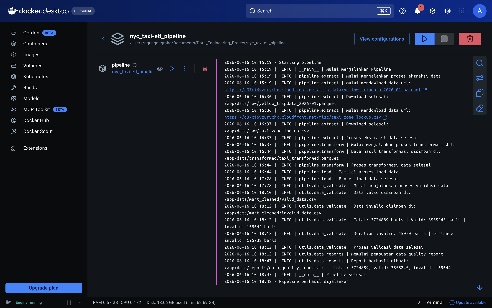
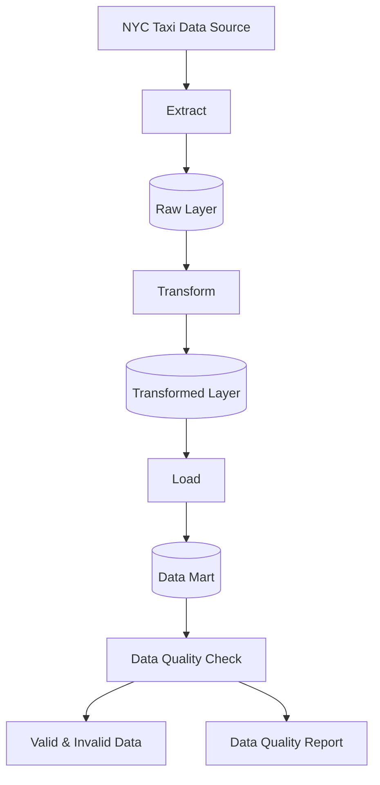

# NYC Taxi Data Pipeline Project


## Screenshots

**Docker Compose Container**



This shows Docker running the NYC Taxi ETL pipeline containers.


## Architecture Overview



## **Technology Stack**
- **Python 3.13+** - Core programming language
- **Pandas** - Data manipulation and transformation
- **PyArrow** - Parquet file processing
- **Requests** - Data extraction from external sources
- **Docker** - Containerization and environment consistency


## **Project Structure**
```plaintext
nyc_taxi-etl_pipeline/
├── config/                 # Configuration & settings logging
├── pipeline/               # ETL core logic (extract, transform, load, validate, reporting)
├── utils/                  # Helper functions
├── data/                   
│   ├── raw/                # Raw extracted data
│   ├── transformed/        # Cleaned & transformed data
│   ├── mart_cleaned/       # Validated final dataset
│   ├── mart/               # Data mart (analytics-ready)
│   └── reports/            # Data quality reports
├── scripts/                # Automation scripts (entry point)
├── images/                 # Documentation assets
├── logs/                   # Pipeline logs
├── main.py                 # Python orchestration entry point
├── Dockerfile              # Container definition
├── docker-compose.yml      # Multi-container setup
├── requirements.txt        # Dependencies
└── README.md
```
## Pipeline Flow
The pipeline runs in the following order:

**1. Extract**
- Download NYC Taxi dataset from external source
- Store into data/raw/

**2. Transform**
- Standardize column names into snake_case format  
- Convert pickup and dropoff datetime into proper datetime type  
- Create time-based features (trip duration, pickup hour, day, weekend flag)  
- Create time period segmentation (Late Night, Morning, Afternoon, etc.)  
- Map categorical values (payment type, store and forward flag) into readable labels  
- Enrich dataset with location data (pickup and dropoff borough & zone) using zone lookup table  
- Store transformed dataset into `data/transformed/`

**3. Load**
- Load transformed data into data/mart/

**4. Data Quality Check**
- Business rule validation for trip duration and trip distance  
- Identify invalid records and categorize error types  
- Split dataset into valid and invalid records  
- Store valid/invalid records → `mart_cleaned/`  

**6. Report Generation**
- Generates data quality summary including total rows, columns, valid and invalid records  
- Calculates valid vs invalid record percentage distribution  
- Provides duplicate records summary  
- Generates missing values analysis per column  
- Summarizes invalid records based on error types
- Outputs a structured text-based data quality report stored in `data/reports/`  

## **Installation & Setup**

Clone the repository:

```bash
git clone https://github.com/agungngrh/nyc_taxi-etl_pipeline.git
cd nyc_taxi-etl_pipeline
```

Create and activate a virtual environment:

```bash
python3 -m venv .venv
source .venv/bin/activate
```

Install project dependencies:

```bash
pip install -r requirements.txt
```

## Running the Pipeline

Run the ETL pipeline using the automation script:

```bash
./scripts/entry_point.sh
```

## Running with Docker

Build and run the pipeline inside a Docker container:

```bash
docker compose up --build
```

## Data Layer Explanation
- Raw Layer → Original untouched dataset
- Transformed Layer → Cleaned and standardized data
- Data Mart → Analytics-ready dataset
- Mart Cleaned → Fully validated dataset
- Reports → Data quality summary and metrics


## Future Improvements

- Add unit testing(pytest)
- Integrate PostgreSQL as a data warehouse
- Implement other technologies
- Add dashboard visualization