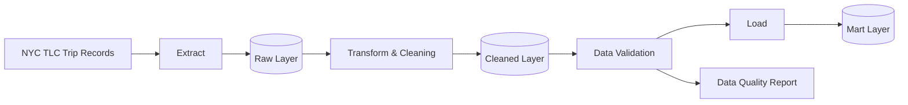
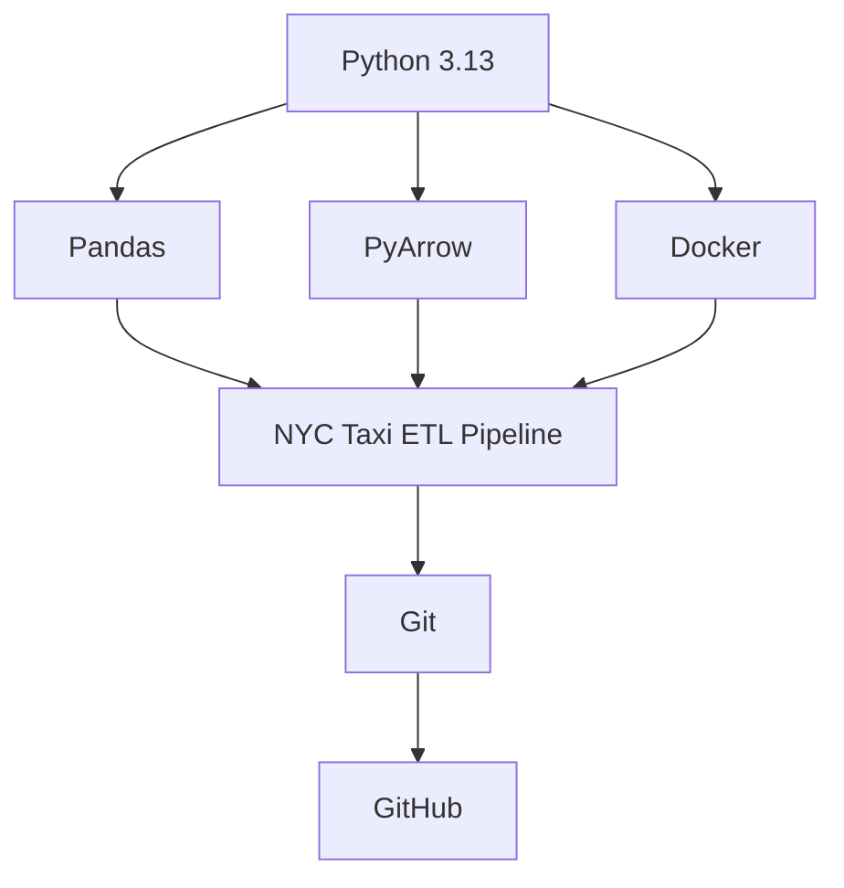

# **NewYorkTaxi Data Pipeline Data Engineering Project**
## **1. Screenshots**
1. **Docker Compose Container**
    
    This shows Docker running in our containers for the NYC Taxi pipeline.

## **2. Overview**

The **NYC Taxi Pipeline Engineering Project** is a simple data engineering solution designed to extract, transform, and load NYC taxi trip data for analytical purposes. The project demonstrates a complete ETL workflow, including data ingestion, processing, validation, and storage.



## **3. Technology Stack**
- **Python 3.13+**
- **Docker**



## **4. Project Structure**
```plaintext
nyc_taxi-etl_pipeline/
├── config/
├── pipeline/
├── utils/
├── data/
│   ├── raw/
│   ├── transformed/
│   ├── mart_cleaned/
│   ├── mart/
│   └── reports/
├── scripts/
├── images/
├── logs/
├── main.py
├── Dockerfile
├── docker-compose.yml
├── requirements.txt
└── README.md
```

## **5. Installation & Usage**
## Installation

Clone the repository:

```bash
git clone https://github.com/your-username/nyc_taxi-etl_pipeline.git
cd nyc_taxi-etl_pipeline
```

Create and activate a virtual environment:

```bash
python3 -m venv .venv
source .venv/bin/activate
```

Install project dependencies:

```bash
pip install -r requirements.txt
```

## Running the Pipeline

Run the ETL pipeline locally:

```bash
python main.py
```

## Running with Docker

Build and start the container:

```bash
docker compose up --build
```

Run in detached mode:

```bash
docker compose up -d --build
```

## 6. Output

After the pipeline is executed successfully, the following outputs are generated:

```plaintext
data/
├── transformed/
│   └── taxi_transformed.parquet
├── mart_cleaned/
│   ├── valid_data.csv
│   └── invalid_data.csv
├── mart/
│   └── taxi_mart.csv
└── reports/
    └── data_quality_report.txt
```

## 7. Data Quality Validation

The pipeline performs several validation checks:

- Missing value detection
- Duplicate record detection
- Data type validation
- Business rule validation
- Valid and invalid record separation

A detailed quality report is generated automatically after each pipeline execution.

## 8. Future Improvements

- Add unit testing
- Integrate PostgreSQL as a data warehouse
- Implement other technologies
- Add dashboard visualization
- Deploy the pipeline to a cloud environment